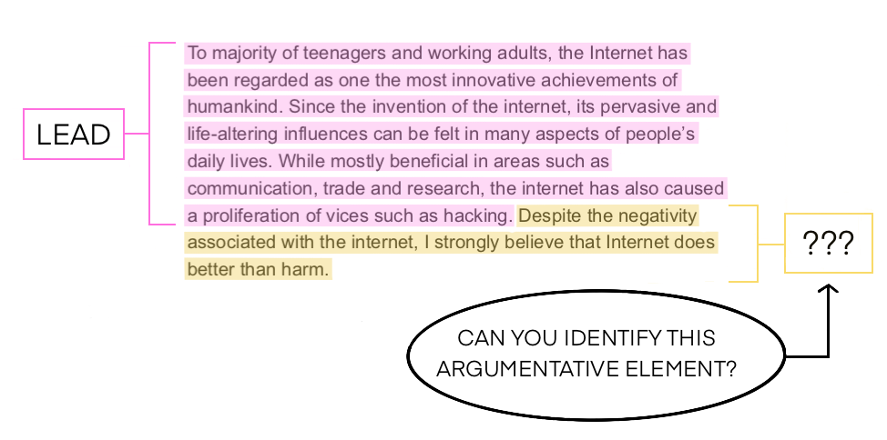
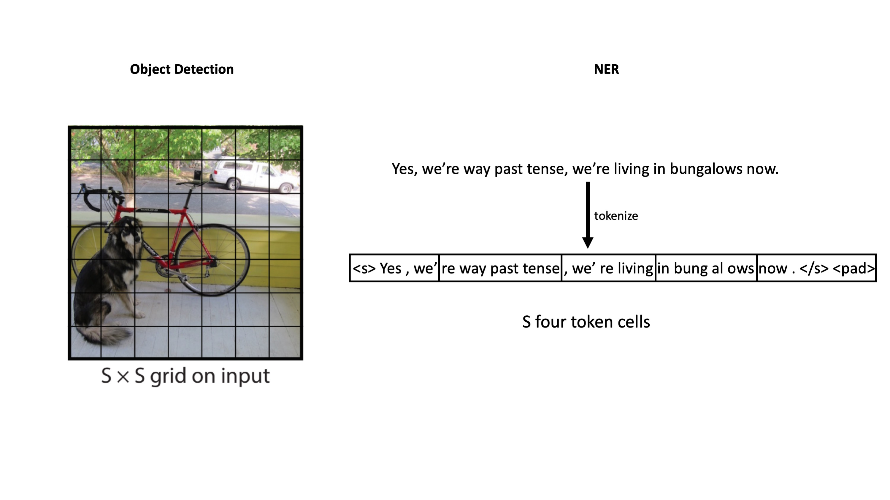

# yolo-nlp

This project applies the convolutional structure of the YOLO algorithm for object detection in images to a [named entity recognition](https://en.wikipedia.org/wiki/Named-entity_recognition) (NER) task in natural language processing (NLP).  The inspiration for this project was [a competition](https://www.kaggle.com/competitions/feedback-prize-2021/overview) hosted by Georgia State University for automated student writing evaluation.  The basic competition task was to classify blocks of text from student essays as belonging to one of seven discourse elements: Lead, Position, Claim, Counterclaim, Rebuttal, Evidence, or Concluding Statement.  A successful algorithm could assist or replace the rote labor of instructors, allowing the latter to focus efforts on more creative and fulfilling aspects of their work, as well as allowing students more timely and direct access to feedback on their writing through automated interfaces.  Here is an example taken from the competition overview:



What is unique about this task and what distinguishes it from more traditional NER problems is the diversity of length scales associated with the entities to be recognized.  Typical NER tasks involve identifying things like people, organizations, places, dates, and so forth.  While there is considerable semantic variation across these more typical referents, they all share the characteristic that their symbols consist of on the order of one word in a natural language.  Joe Schmoe, for example, is a person (two words).  Seattle is a place (one word).  May fifth is a date (two words).  You would never represent any of these things as entire sentences, let alone paragraphs.  In the student writing evaluation problem, on the other hand, we are tasked with identifying and classifying blocks of text that can range in length from a few words, to a sentence, to multiple paragraphs.  This proliferation of length scales makes evaluating student writing an intrinsically hard problem.  

Another problem, from a different field of machine learning, that involves a proliferation of length scales is object detection in natural images, which possess the important property of approximate [scale invariance](https://www.tandfonline.com/doi/pdf/10.1088/0954-898X_5_4_006) (meaning that objects can appear at any length scale in an image).  The annals of computer vision research are replete with examples of ingenious algorithms to detect and classify objects at varying scales (examples include [sliding windows](https://pyimagesearch.com/2015/03/23/sliding-windows-for-object-detection-with-python-and-opencv/), [R-CNNs](https://arxiv.org/abs/1311.2524), [Fast R-CNNs](https://arxiv.org/pdf/1504.08083.pdf), and [Faster R-CNNs](https://arxiv.org/abs/1506.01497)).  Many of these algorithms are complex, slow, and hard to train due to the need to consider many region proposals for processing just a single image (because, again, there can be objects of interest at any position and any scale). 

A major breakthrough in object detection came in 2015 with the introduction of the [YOLO](https://arxiv.org/pdf/1506.02640.pdf) model architecture.  YOLO greatly simplifies the task of object detection by treating it as a regression problem of predicting bounding box locations and object class probabilities.  This regressionn is cleverly structured using a series of convolutional layers, allowing the network to perform object detection in a single pass -- hence the name YOLO, an acronym for "you only look once."  This gain in efficiency has enabled accurate real time object detection at speeds faster than standard video frame rates, something that had not been possible previously.  

In the following we will borrow the YOLO model architecture and repurpose it for the NLP task of NER under conditions of approximate scale invariance (i.e. named entities have a wide distribution of lengths, as in the student writing evaluation problem described above).  As we will see, the basic ideas of YOLO can be straightforwardly generalized and used for a variety of scale invariant inputs apart from images, including long passages of natural language.  

# Pixels and Word Vectors

At first glance it may seem that processing images and texts could not be more different.  Images, as we know, are defined by an array of pixels, each storing three or four real number values representing the color intensity at that location in the image.  In this sense, each pixel can be thought of as a three or four component vector.  Natural language texts, on the other hand, appear to be far less regular in structure, consisting of words and sentences of varying length and construction.  This shouldn't really surprise us, given that digital photography is an invention of the twentieth century and human language dates to the misty dawn of history.  Nevertheless, it turns out that a very powerful way of computationally processing natural language involves first converting a text passage into a series of vectors, just as image digitization involves transducing an analog light field into an array of pixel value vectors.  From this perspective, natural language and image data are practically identical -- both are represented as collections of vectors arranged in a formal geometric structure.  The only major difference is that for images these vectors are arranged in a two dimensional geometry (the image plane), whereas for text the vectors are arranged in a one dimensional geometry (the sequential order of the text as it is written or spoken).  Dealing with this difference in dimensionality between the two data types will constitute the bulk of the work in transforming YOLO to a natural language processor.

First, however, let's review the process of text vectorization.  This can be broken down into two stages: *tokenization* and *embedding*.

## Tokenization

Tokenization is the first step in preprocessing a text input.  It can be understood as a way of normalizing or standardizing natural language inputs so that they can be more easily interpreted by a machine.  Perhaps the simplest form of tokenization is splitting on spaces.

```python
>>>input_text = 'I haven\'t walked on the moon yet.'
>>>tokens = input_text.split()
>>>print(tokens)
['I', "haven't", 'walked', 'on', 'the', 'moon', 'yet.']
```

This reduces the input string to a series of standard symbols (in this case English words) that can be more readily fed into a machine learning model.  Simply splitting on spaces, however, leaves much to be desired.  For instance, this method completely neglects punctuation, contractions, and different word endings (it might make sense, for example, if the tokens for "walk" and "walked" had something in common).  

For the present purposes we will be using the tokenization scheme employed by the [longformer](https://arxiv.org/pdf/2004.05150.pdf) model (more on this to come).  We use the [huggingface](https://huggingface.co/docs/transformers/model_doc/longformer) repository to load the tokenizer and give an example of how it breaks a sentence down into tokens.

```python
>>>from transformers import AutoTokenizer
>>>model_name = 'allenai/longformer-base-4096'
>>>tokenizer = AutoTokenizer.from_pretrained(model_name)

>>>input_text = 'I haven\'t walked on the moon yet.'
>>>tokens = tokenizer.encode(input_text)
>>>print(tokens)
[0, 100, 2220, 75, 3203, 15, 5, 6950, 648, 4, 2]
```

The pretrained tokenizer converts our input string into a series of integers, where the first and last (0 and 2) are special stop and start characters.  Each of these integers maps to a string token by way of the vocab dictionary stored in the tokenizer object.  For example:

```python
>>>tokenizer.vocab[' moon']
6950
```
We can see the string representation of the full tokenized text like this:

```python
>>>[tokenizer.decode(x) for x in tokens]
['<s>',
 'I',
 ' haven',
 "'t",
 ' walked',
 ' on',
 ' the',
 ' moon',
 ' yet',
 '.',
 '</s>']
```

Compound words and punctuation are automatically broken up into elementary units by the tokenization procedure.  The vocabulary for this tokenizer consists of 50,265 such units.

## Embedding  

In principle, we could feed these tokens directly into a neural network, either as integers or as one-hot encoded vectors, then proceed to train that network on our classification task.  This, however, would be passing up a significant opportunity to capitalize on the magic of *transfer learning*.  Words, after all, are ubiquitous things that are used in a wide variety of contexts.  Wouldn't it be nice if we could utilize our vast experience with language to represent the words in a way that captures their intrinsic meanings?  This is precisely what is behind the concept of word embedding.  

An embedding is a vector representation of a word (typically with a few hundred dimensions) with the properties that words with similar meanings lie near to each other in the vector space (e.g., as measured by cosine similarity) and, fascinatingly, that arithmetic operations on vectors translate to [semantic operations](https://kawine.github.io/blog/nlp/2019/06/21/word-analogies.html) on words.  A classic example of word embedding is the [word2vec](https://arxiv.org/pdf/1301.3781.pdf) algorithm proposed by Google researchers in 2013.  Word embeddings are trained on massive corpora of text, enabling them to capture information about the intrinsic meanings of words and embed that information into the word representations.  This additional language knowledge can then be transferred to other NLP tasks by using the embedding operation as an early layer in the model pipeline.  This is an example of transfer learning, in which information gleaned from one task is transferred to a completely separate task with a similar underlying structure -- in this case, that structure is the structure of a natural language.

Once again, we will use the [longformer](https://arxiv.org/pdf/2004.05150.pdf) embeddings, which are stored in a hidden layer of the model.

```python
from transformers import TFAutoModelForTokenClassification
model_name = 'allenai/longformer-base-4096'
longformer_pretrained = TFAutoModelForTokenClassification.from_pretrained(model_name,num_labels=24,output_hidden_states=True) #see below for explanation of num_labels

#A function for tokenizing with padding out to 1024 tokens for input to the longformer model
max_length=1024
def tokenize(x):
	tokens = tokenizer.encode_plus(x, return_tensors='tf', return_offsets_mapping=True, max_length=max_length, padding='max_length', truncation=True)
	return tokens[0].ids

token_ids = tokenize('This would be a better world for children if the parents had to eat the spinach!')

out = longformer_pretrained(tf.expand_dims(tf.constant(token_ids),0)) #we'll neglect attention for the time being

embbeddings = out[1][0] 
```

The `embeddings` variable is now a 1 x 1024 x 768 tensor, corresponding to a 768 dimensional vector representation for each of the 1024 tokens in the input (including the padding).  

In fact, there is really no reason to truncate this model and look only at the output of the embeddings layer.  We might as well take advantage of the full pretrained model and produce a representation of the input tokens that utilizes the attention mechanism of the transformer architecture.  This will enable information about the context of each word in the sentence to be used in forming the vector representation of that word.  In doing so, we can choose the dimensionality of the vector representation at will by specifying the number of class labels through the parameter `num_labels`.  To be clear, we are using a classification model, which will output a probability estimate for each of the `num_labels` classes for each token, and then we are choosing to interpret that output as a vector representation of that token which we will subsequently feed into a convolutional network.  This can be accomplished with the following model class:

```python
class TokenClassifier(keras.Model):
	def __init__(self,**kwargs):
		super().__init__(**kwargs)
		self.longformer = longformer_pretrained

	def call(self,inputs):
		#the format of the inputs will become clear below, when we build the dataset
		longformer = self.longformer(inputs['input_ids'], 
		                             attention_mask=inputs['attentions'])
		out = tf.nn.softmax(longformer[0],axis=2) #add a softmax to convert from logits to class probabilities, thereby normalizing the inputs to the convolutional layer
		return out
```

We have chosen `num_labels = 24` because the student writing evaluation task has 8 possible labels (including no label), and NER can typically include three classes for each label (B, I, and E for Begin, Interior, and End).  This is somewhat of an arbitrary choice.  In reality the dimensionality of the embedding should be thought of as a hyperparameter that can be tuned during training.  Running this classifier on a tokenized input text will now output a sequence of 1024 24-dimensional vectors (one for each input token) that can thereafter be used as input to a YOLO layer.

# YOLO in 1D

Now that we have managed to represent our input text as a sequence of meaningful word vectors, we are ready to feed these into a convolutional YOLO model.  The main difference between our YOLO model for NLP and the original YOLO for object detection is that ours will take one dimensional inputs (i.e. sequences) rather than two dimensional image inputs.  Incidentally, this grants us the opportunity to hone our understanding of YOLO on a simplified one dimensional model and therefore serves as a useful pedagogical tool as well.

YOLO begins by breaking up the input into a discrete set of cells.  For images, these cells correspond to a grid of boxes, where each box encloses a distinct subset of image pixels.  For sequence data, like natural language text, the cells correspond to a set of bins, where each bin contains a distinct susbet of tokens.  



The basic idea is that each bin is responsible for recognizing a named entity only if the starting token of the named entity falls within the bin in question. Thus for each bin we perform a regression on four variables: class probability, starting position of the named entity within the bin, length of the named entity (in number of tokens), and a confidence score, representing the model's confidence that the bin in fact contains a named entity.  Constructing the model is fairly straightforward, as seen below:

```python
class Yolo1D(keras.Model):
	def __init__(self,**kwargs):
		super().__init__(**kwargs)
		self.conv1 = Conv1D(18,4,strides=2,padding='same',activation = 'relu',input_shape = (1024,24))
		self.conv2 = Conv1D(36,4,strides=2,padding='same',activation = 'relu')

		self.class_out = Dense(7,activation='softmax')
		self.start_out = Dense(4,activation='softmax')
		self.length_out = Dense(1,activation='relu')
		self.confidence_out = Dense(1,activation='sigmoid')
	def call(self,inputs): 
		convolved = self.conv2(self.conv1(inputs))
		class_out = self.class_out(convolved)
		start_out = self.start_out(convolved)
		length_out = self.length_out(convolved)
		confidence_out = self.confidence_out(convolved)
		return tf.concat((class_out,start_out,length_out,confidence_out),axis=2)
```

Here we have chosen to use two convolutional layers and bins that enclose four tokens.  It would be easy to add more convolutional layers or change the bin size.  These should be viewed as hyperparameters when attempting to construct an optimal model.  We experiment with additional [Inception](https://www.cs.unc.edu/~wliu/papers/GoogLeNet.pdf) style convolutional layers in the coding file. 

Let's combine our YOLO model with the token classifier of the previous section to create a single model pipeline for scale invariant named entity recognition:

```python
class FullModel(keras.Model):
	def __init__(self,**kwargs):
 		super().__init__(**kwargs)
 		self.token_classifier = TokenClassifier()
 		self.yolo = Yolo1D()
	def call(self,inputs):
 		predicted_proba = self.token_classifier(inputs)
 		return self.yolo(predicted_proba)
``` 

# Creating a Train and Test Set

We will now test out our model on data from the student writing evaluation task.  The data is contained in a .csv file that we can load into a pandas dataframe.

```python
>>>import pandas as pd
>>>trainpath = '.../train.csv'
>>>train = pd.read_csv(trainpath)
>>>train.columns
Index(['id', 'text', 'starts', 'ends', 'labels'], dtype='object')
```

Each row in the dataframe corresponds to a different student essay with an id tag stored in the `id` column.  The full text of the essay is stored in the `text` column.  Each named entity in a given essay is assigned a word indexed `start` and `end` value in addition to a `label`, identifying which class it belongs to.

To convert this into a data set for model training, we must tokenize each text and compute the true regression variables (class probability, start position, length, and confidence) for our YOLO model.

```python
max_length=1024
def tokenize(x):
	tokens = tokenizer.encode_plus(x, return_tensors='tf', return_offsets_mapping=True, max_length=max_length, padding='max_length', truncation=True)
	return tokens[0].ids, tokens[0].offsets, tokens[0].attention_mask

def generate_starts(x):
	offsets = x.offsets.numpy()
	starts = x.starts
	return tf.constant([np.argmin(abs(s-offsets)) for s in starts],dtype=tf.int32)

def generate_ends(x):
	offsets = x.offsets.numpy()
	ends = x.ends
	return tf.constant([np.argmin(abs(s-offsets)) for s in ends],dtype=tf.int32)

tmp = train.text.apply(tokenize)
train['tokens'] = tmp.apply(lambda x:tf.constant(x[0]))
train['offsets'] = tmp.apply(lambda x:tf.constant([a[0] for a in x[1]]))
train['attention_mask'] = tmp.apply(lambda x:tf.constant(x[2]))
train['token_starts'] = train.apply(generate_starts,axis=1)
train['token_ends'] = train.apply(generate_ends,axis=1)
train['token_lengths'] = train.token_ends-train.token_starts
```

Now we generate the true labels for our regression problem:

```python
start_arr=np.zeros((len(train),256))
class_arr=np.ones((len(train),256))
length_arr = np.zeros((len(train),256)) 
confidence_arr=np.zeros((len(train),256)) 
for i in range(len(train)):
	for j,lab in enumerate(train.labels.iloc[i]):
		ind = int(np.floor(train.token_starts.iloc[i][j]/4))
		start_val = np.mod(train.token_starts.iloc[i][j],4)
		class_arr[i,ind] = label_map[lab]
		start_arr[i,ind] = start_val
		length_arr[i,ind] = train.token_lengths.iloc[i][j]
		confidence_arr[i,ind] = 1
```

Finally, we can load this all into a tensorflow dataset and split it into test, train and cross validation sets.  

```python
ds=tf.data.Dataset.from_tensor_slices((
	{'input_ids':tf.stack(train.tokens),
	'attentions':tf.stack(train.attention_mask)},
	tf.concat((
	tf.cast(tf.one_hot(tf.constant(class_arr,dtype=tf.int32),7),tf.float32),
	tf.cast(tf.one_hot(tf.constant(start_arr,dtype=tf.int32),4),tf.float32),
	tf.cast(tf.expand_dims(tf.constant(length_arr,dtype=tf.float32),axis=2),tf.float32),
	tf.cast(tf.expand_dims(tf.constant(confidence_arr,dtype=tf.float32),axis=2),tf.float32)),
	axis=2)
	))

#split into a test, train, and cv set
size = len(train)
train_size = int(0.8*size)
test_size = int(0.1*size)
ds = ds.shuffle(1000,seed=12)
ds_train = ds.take(train_size)
ds_test = ds.skip(train_size).take(test_size)
ds_val = ds.skip(train_size + test_size)

#Prepare the data for training
AUTOTUNE = tf.data.AUTOTUNE
batch_size = 2
ds_train = ds_train.batch(batch_size).cache().prefetch(buffer_size=AUTOTUNE)
ds_val = ds_val.batch(batch_size).cache().prefetch(buffer_size=AUTOTUNE)
ds_test = ds_test.batch(batch_size).cache().prefetch(buffer_size=AUTOTUNE)

```

# Compiling and Training the Model

Before we can train the model, we need to define a loss function.  It will also be helpful to define an F1 score metric so that we can monitor the training progress.  

The loss function that we use is similar to the one used in the original YOLO paper, except we have recast it in a form that is appropriate for one dimensional outputs:

```python
#loss function
def yolo_loss(y_true,y_pred):
	lambda_coord = 5
	lambda_noobj = 0.5
	class_true, start_true, length_true, conf_true = tf.split(y_true,[7,4,1,1],-1)
	class_pred, start_pred, length_pred, conf_pred = tf.split(y_pred,[7,4,1,1],-1)

	conf_true = conf_true[:,:,-1]
	length_true = length_true[:,:,-1]
	conf_pred = conf_pred[:,:,-1]
	length_pred = length_pred[:,:,-1]

	class_loss = tf.math.reduce_sum(tf.square(tf.boolean_mask(class_true,conf_true) - tf.boolean_mask(class_pred,conf_true)))
	conf_loss = tf.math.reduce_sum(tf.square(tf.boolean_mask(conf_true,conf_true) - tf.boolean_mask(conf_pred,conf_true))) \
					+ lambda_noobj*tf.math.reduce_sum(tf.square(tf.boolean_mask(conf_true,1-conf_true) - tf.boolean_mask(conf_pred,1-conf_true)))
	start_loss = lambda_coord*tf.reduce_sum(tf.square(tf.boolean_mask(start_true,conf_true) - tf.boolean_mask(start_pred,conf_true)))
	length_loss = lambda_coord*tf.reduce_sum(tf.square(tf.sqrt(tf.boolean_mask(length_true,conf_true)) - tf.sqrt(tf.boolean_mask(length_pred,conf_true))))

	return conf_loss + class_loss + start_loss + length_loss
```

Finally, we can compile the model and train it.

```python
macro_f1 = F1_Metric()
model = FullModel()
model.compile(loss=yolo_loss, optimizer=tf.keras.optimizers.Nadam(learning_rate=1e-3), metrics=macro_f1) #see code file for f1 metric

#train the model
history = model.fit(ds_train, epochs=2, validation_data=ds_test)
```

Lo and behold, it trains!  Unfortunately, I haven't had access to the computational resources (or sufficient supplies of caffeine to stay up all night keeping a Google colab open) to really test out this model's performance.  For now, it remains a fun exercise in making connections between disparate fields of machine learning and constructing a new model architecture based on the shared characteristic of scale invariance.


